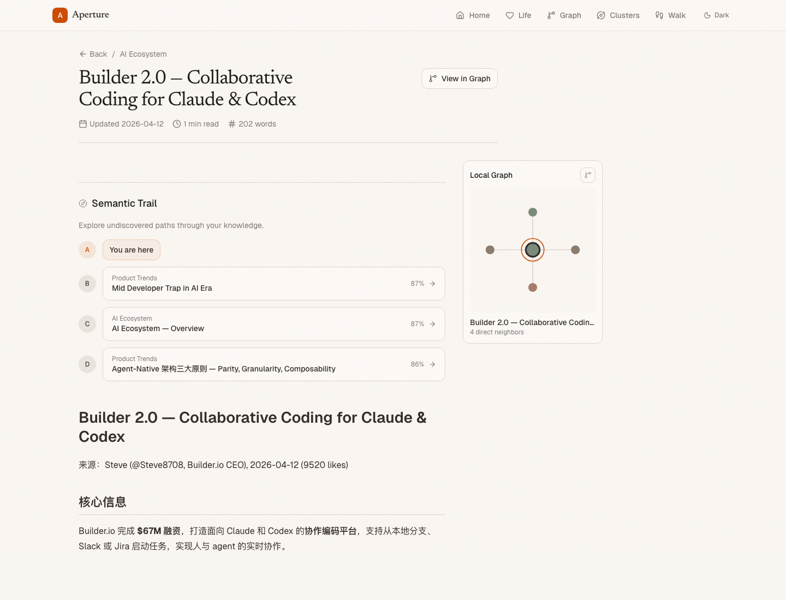
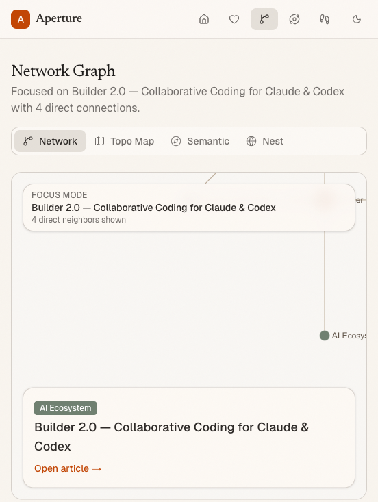
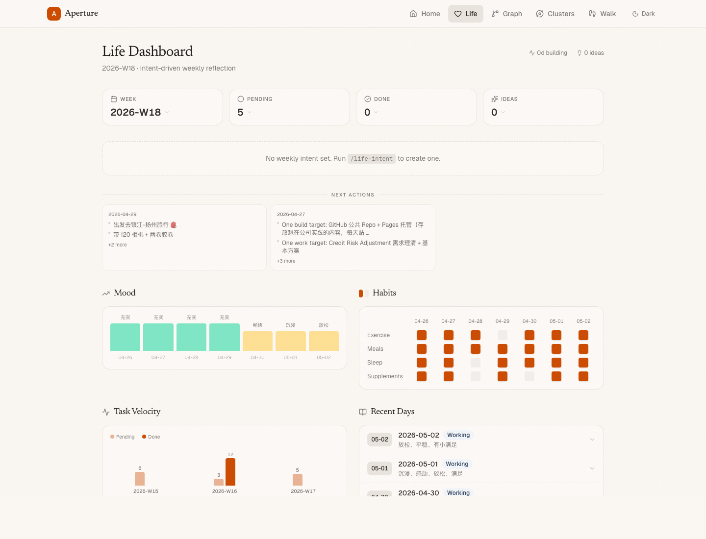
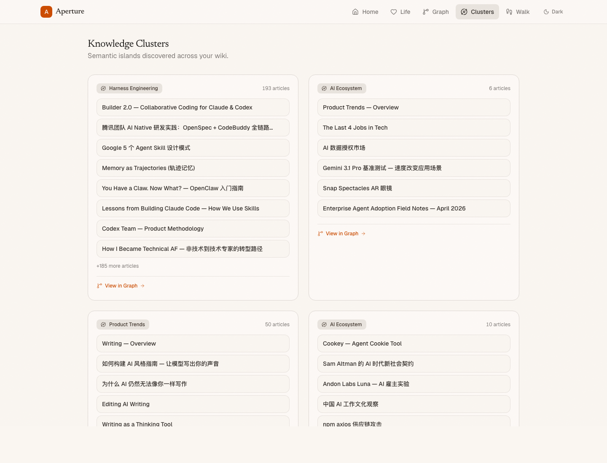

# Aperture

**A markdown-first wiki and life system for agent-native work.**

Aperture turns raw notes, links, transcripts, and daily logs into a browsable LLM Wiki. It keeps the source files in plain markdown, gives agents clean APIs to read them, and adds a life dashboard for tasks, habits, goals, journals, and weekly reviews.

Give the repo to an agent, point it at your vault, and let it set up the wiki, install the skills, ingest sources, open the viewer, and verify the routes.



## Use It

Ask your agent:

```text
Set up Aperture for my vault. Read AGENT_SETUP.md and BASIC_SCHEMA.md, install the .agents/skills/wiki-* skills, configure WIKI_ROOT in .env.local, install dependencies, run the initial ingest and life maintenance commands, start the viewer, and verify /, /life, /wiki/<slug>, /graph, /clusters, /llms.txt, and /api/wiki/<slug>.
```

For a direct local run:

```bash
npm install
cp .env.example .env.local
# Set WIKI_ROOT=/absolute/path/to/your/vault
npm run dev
```

Open [http://localhost:3000](http://localhost:3000).

## What It Provides

### LLM Wiki

Browse `wiki/**/*.md` as a polished web app with wikilinks, backlinks, search, categories, reading metadata, semantic trails, and local graph context.

### Source Provenance

Every article can show where it came from: source links, contribution levels, summaries, affected sections, and evolution history from earlier memories into later pages.

### Graph Exploration

Move from an article into `/graph?focus=<slug>`, inspect semantic clusters, or jump from `/clusters` into a cluster-focused graph. Graph rendering falls back gracefully when WebGL is unavailable.

### Life Dashboard

`/life` reads the same vault for daily journals, tasks, habits, mood, ideas, goals, weekly intent, and reviews. Knowledge work and life management stay in one file-first system.

### Agent Interfaces

Agents can consume the wiki through `/api/wiki/<slug>`, `/llms.txt`, `/llms-full.txt`, exports, health reports, entity reports, graph proposals, and the bundled wiki skills.

## Screenshots

| Wiki Article | Graph Focus |
| --- | --- |
|  |  |

| Life Dashboard | Knowledge Clusters |
| --- | --- |
|  |  |

## Main Entry Points

| Route | What you see |
| --- | --- |
| `/` | Search, recently updated pages, and category overview |
| `/life` | Journals, tasks, habits, goals, weekly intent, and reviews |
| `/wiki/<slug>` | Article, provenance, evolution, backlinks, semantic trail, and local graph |
| `/graph?focus=<slug>` | Focused article graph |
| `/clusters` | Semantic cluster browser |
| `/graph?cluster=<id>` | Cluster-focused graph |
| `/api/wiki/<slug>` | Article JSON for agents |
| `/llms.txt` | Compact agent index |
| `/llms-full.txt` | Full agent index |

## Maintenance

```bash
npm run tasks
npm run weekly-review
npm run graph:proposal -- --focus <slug>
npm run graph:proposal -- --cluster <id>
npm run export:wiki
npm run wiki:health
npm run wiki:entities
```

These commands generate reviewable artifacts for tasks, weekly reviews, graph research, wiki exports, health checks, entity detection, aliases, confidence, and suggested wikilinks.

## Build

```bash
npm run build
```

Required environment:

| Variable | Description |
| --- | --- |
| `WIKI_ROOT` | Absolute path to the vault directory |
| `QMD_INDEX` | Optional qmd index path for semantic features |

## Credits

Inspired by [Andrej Karpathy's LLM Knowledge Bases](https://gist.github.com/karpathy/442a6bf555914893e9891c11519de94f), [Farza's Farzapedia](https://gist.github.com/farzaa/c35ac0cfbeb957788650e36aabea836d), and [Steph Ango's File Over App](https://stephango.com/file-over-app).

## License

MIT
